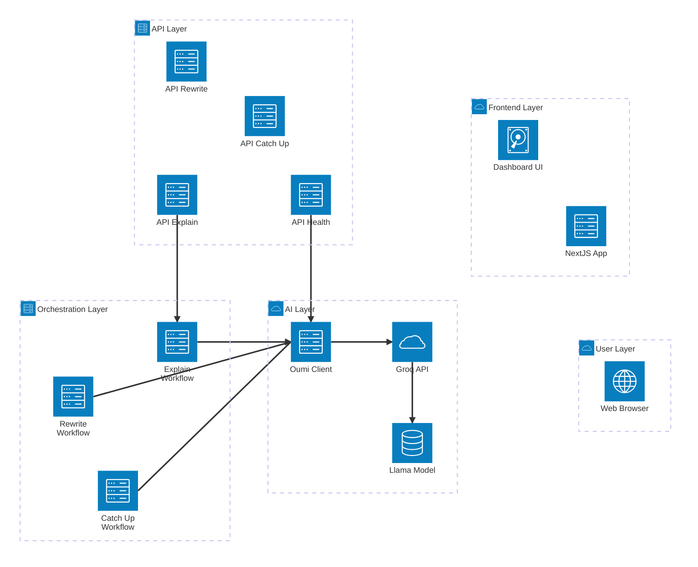

# Bragi Note - Architecture Diagram

## System Architecture

This diagram shows how Bragi Note integrates Oumi (AI framework) and Kestra (workflow orchestration) with the Next.js frontend and Groq AI services.



## Component Descriptions

### User Layer

- **Web Browser**: User interface for interacting with Bragi Note

### Frontend Layer (Next.js 16)

- **Next.js App**: React-based web application with Server Components
- **Dashboard UI**: Main interface for uploading files and viewing AI results

### API Layer (Vercel Serverless)

- **`/api/ai/catch-up`**: "Did I Miss Anything?" - Analyzes meetings/chats for key decisions
- **`/api/ai/rewrite`**: "Say It Better" - Rewrites messages with improved tone
- **`/api/ai/explain`**: "Explain It Like I'm Stressed" - Simplifies complex documents
- **`/api/ai/health`**: Health check endpoint for monitoring AI services

### Orchestration Layer (Kestra Workflows)

- **Catch-Up Workflow**: Multi-step pipeline for meeting analysis
  - Input validation → Preprocessing → AI analysis → Result formatting
- **Rewrite Workflow**: Pipeline for message improvement
  - Input validation → Tone analysis → AI rewriting → Quality check
- **Explain Workflow**: Pipeline for document simplification
  - Input validation → Category detection → AI explanation → Disclaimers

### AI Layer (Oumi Framework)

- **Oumi Client**: Abstraction layer for AI model interaction
  - Handles API calls, retries, and error handling
  - Formats prompts and parses responses
- **Groq API**: Fast LLM inference platform (free tier)
  - 7,000 requests per minute
  - 200M+ tokens per day
  - ~300 tokens/second speed
- **Llama 3.1 70B**: Large language model for text generation
  - 70 billion parameters
  - Versatile model for various tasks

## Data Flow

### Example: "Did I Miss Anything?" Feature

1. **User uploads meeting transcript** → Browser
2. **Dashboard sends POST request** → `/api/ai/catch-up`
3. **API route receives text** → Calls Kestra workflow
4. **Kestra orchestrates pipeline**:
   - Step 1: Validates input (text length, format)
   - Step 2: Preprocesses text (cleaning, chunking)
   - Step 3: Calls Oumi client with structured prompt
   - Step 4: Formats results into structured response
5. **Oumi client sends request** → Groq API
6. **Groq processes with Llama 3.1 70B** → Returns completion
7. **Response flows back through layers**:
   - Groq → Oumi → Kestra → API → Dashboard → Browser
8. **User sees results**: Decisions, action items, deadlines

## Key Technical Decisions

### Why Groq?

- **Free tier**: 7,000 RPM, 200M+ tokens/day (sufficient for MVP)
- **Fast inference**: ~300 tokens/second (better UX)
- **Production-ready**: Stable API, good uptime
- **Cost-effective**: $0 for MVP phase

### Why Kestra as TypeScript Functions?

- **Vercel compatibility**: Runs as serverless functions
- **No extra infrastructure**: No separate orchestration server needed
- **Type safety**: Full TypeScript support
- **Easy debugging**: Standard Node.js debugging tools
- **Future migration**: Can move to Kestra server later if needed

### Why Oumi?

- **Abstraction**: Easy to swap AI providers in the future
- **Standardized interface**: Consistent API across features
- **Error handling**: Built-in retry and fallback logic
- **Monitoring**: Health checks and logging

## Deployment Architecture

```mermaid
architecture-beta
    group dev(cloud)[Development]
    group prod(cloud)[Production]

    service local(server)[Local Dev Server] in dev
    service localhost(internet)[localhost 3000] in dev
    localhost:R --> L:local
    local:B --> T:groq_prod

    github:R --> L:vercel
    vercel:R --> L:cdn
    vercel:B --> T:groq_prod
```

### Development Environment

- **Local Dev Server**: `yarn dev` runs Next.js on port 3000
- **Hot Reload**: Instant feedback during development
- **Direct Groq API**: Same API used in production

### Production Environment

- **GitHub**: Source code repository
- **Vercel**: Automatic deployments on push
- **CDN**: Global edge network for static assets
- **Serverless Functions**: API routes run on-demand
- **Groq API**: External AI service

## Monitoring & Health


- **User Accounts**: Authentication and authorization
- **History**: Save previous AI results
- **Preferences**: User-specific settings
- **Analytics**: Usage tracking and insights

### Phase 3: Real-time Features

- **WebSockets**: Live collaboration
- **Streaming**: Token-by-token AI responses
- **Notifications**: Real-time updates

### Phase 4: Self-hosted Kestra

- **Separate Service**: Kestra server for complex workflows
- **Advanced Features**: Scheduled jobs, retries, monitoring
- **Scalability**: Handle higher throughput

## Technology Stack Summary

| Layer         | Technology          | Purpose              | Cost                     |
| ------------- | ------------------- | -------------------- | ------------------------ |
| Frontend      | Next.js 16          | Web application      | $0 (Vercel free tier)    |
| Hosting       | Vercel              | Deployment & CDN     | $0 (100 GB-hours/month)  |
| API           | Next.js API Routes  | Serverless functions | $0 (included in Vercel)  |
| Orchestration | Kestra (TypeScript) | Workflow patterns    | $0 (no separate service) |
| AI Framework  | Oumi                | Model abstraction    | $0 (open source)         |
| AI Provider   | Groq                | LLM inference        | $0 (7,000 RPM free tier) |
| Model         | Llama 3.1 70B       | Text generation      | $0 (via Groq)            |
| **Total**     |                     |                      | **$0/month**             |

## Resources

- **Groq Console**: https://console.groq.com
- **Oumi Docs**: https://oumi.ai
- **Kestra Docs**: https://kestra.io
- **Next.js Docs**: https://nextjs.org
- **Vercel Docs**: https://vercel.com/docs

---

_Last Updated: December 14, 2025_
